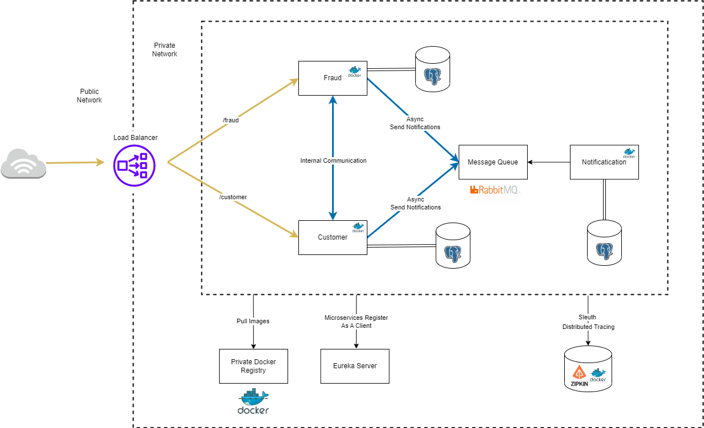

# Microservices

Microservice using spring cloud, containing some of the patterns of distributed systems such as service discovery, message broker, distributed tracing and others. It also has settings for Docker and Kubernetes for containerize and deployment.

